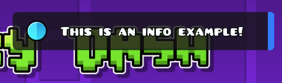
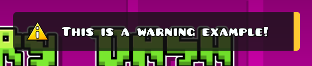
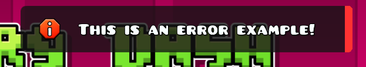

# notif api for geometry dash
check out https://forgejo.hlelo.cc/Miskaa/notif/releases releases page on my friends forgejo page
ALSO check out mUtils, its on my github :3

If you are not a developer, you dont really need to check this out lol

Enjoy the shitty readme.md file i made when its 11pm/midnight on a school day :3

Look at the forgejo/github page page since im too lazy to make geode readme better. so enjoy this outdated mess (partially, also its ORIGINALREADME.md on Github)

## Usage:
### Regular:
In my notif api, theres something called *customizability* (if youre using fancy ofc), theres also predefined functions if youre lazy
```cpp
void notif(const std::string& text, const std::string& type = "info");
void info(const std::string& text);    // info
void warn(const std::string& text);    // warning  
void error(const std::string& text);   // error
void loading(const std::string& text); // loading
void success(const std::string& text); // success
```
If you are dumb enough to not understand anything, theres ``notifapi::info``, ``notifapi::warn``, ``notifapi::error``, ``notifapi::loading``, ``notifapi::success`` etc. \
I've given out example screenshots in the screenshots section. didnt test out loading tho, but its just a loading bar you see when youre loading online levels

### Fancy oooo:
Yes. there's customizability, shockers.
Check out the screenshots since i set some examples there.

Header file code:
```cpp
void fnotif(const std::string& text, const std::string& type = "info", float time = 3.0f, cocos2d::ccColor3B accentColor = {0, 0, 0}, float scale = 1.0f, Position position = Position::TopRight, Animation animation = Animation::Slide, const std::string& customSound = "", float volume = 1.0f, cocos2d::CCNode* customIcon = nullptr, bool blur = true, int blurPasses = 1);
```
Again, if you're dumb, its basically ``notifapi::fnotif(example1, "info", 3.0f, cocos2d::ccColor3B{50, 125, 255}, 1.0f, notifapi::Position::TopRight, notifapi::Animation::Slide, "", 0.8f)``
```cpp
notifapi::fnotif(example1, "info", 3.0f, cocos2d::ccColor3B{50, 125, 255}, 1.0f, notifapi::Position::TopRight, notifapi::Animation::Slide, "", 0.8f);

// example1 is a string, so it can be:
std::string example1 = "Hello from notif!";
notifapi::fnotif(example1, "info", 3.0f, cocos2d::ccColor3B{50, 125, 255}, 1.0f, notifapi::Position::TopRight, notifapi::Animation::Slide, "", 0.8f);
// or i guess you can just do this:
notifapi::fnotif("Hello from notif!", "info", 3.0f, cocos2d::ccColor3B{50, 125, 255}, 1.0f, notifapi::Position::TopRight, notifapi::Animation::Slide, "", 0.8f); // no std::string required

// first 3.0f is duration, so it can be 6.9f, 6.7f, 1.0f etc.
// cocos2d::ccColor3B is RGB color code for accent bar (aka thing on the right)
/*
   Error RGB (ccColor3B) is 255, 50, 50 (as provided in the last error example)
   You can use any other RGB color
*/

// last 1.0f is scale, so it can be 0.5f (smaller), 1.5f (bigger), 2.0f (huge) etc.
// final 0.8f is volume, so it can be 0.0f (silent), 0.5f (quiet), 1.0f (max) etc.
// volume respects game sound fx settings, so if game effects sounds are muted, notification sound will be muted too

// customIcon: pass any CCNode* to use a custom icon from outside resources, THE BEST if you use a 116x116 icon pls i(MalikHw) didnt know how to force resize to that anyways im a bit bad at coding
// pass nullptr (or just omit it) to use the default type icon
auto myIcon = cocos2d::CCSprite::create(Mod::get()->getResourcesDir() / "your-icon.png");
notifapi::fnotif("Hello from notif!", "info", 3.0f, cocos2d::ccColor3B{50, 125, 255}, 1.0f, notifapi::Position::TopRight, notifapi::Animation::Slide, "", 1.0f, myIcon);

// blur: pass false to disable blur for this notification, defaults to true
// blurPasses: controls blur intensity, ignored if blur=false...
notifapi::fnotif("Hello from notif!", "info", 3.0f, {0,0,0}, 1.0f, notifapi::Position::TopRight, notifapi::Animation::Slide, "", 1.0f, nullptr, false); // no blur
notifapi::fnotif("Hello from notif!", "info", 3.0f, {0,0,0}, 1.0f, notifapi::Position::TopRight, notifapi::Animation::Slide, "", 1.0f, nullptr, true, 3); // blur with 3 passes
```
Also, since i included my mUtils project into here. you can do this:
```cpp
mutils::DelayedTask::wait(5.0f, []() {
    notifapi::warn("this is a warning, be scared, something went wrong OwO");
});
```
All you really need to know is: ``5.0f`` is the time

### Including etc.
To include mUtils, you can git clone the repo, or just copy this entire repository as it is right now \
Then, in your source file:
```cpp
#include "includes/mutils/index.hpp"
```
the ``"includes/mutils"`` path can be anywhere, as long it contains the ``index.hpp`` file and ``qol``, ``string``, ``ui`` folders \

To include the notif file, you either put
```json
  "dependencies": {
    "geode.node-ids": ">=v1.23.3",
    "miskaa.notif": ">=1.0.3",
  }
```
in your mod.json file (not supported) \
**OR:**
1. clone this repository
2. copy the ``src/`` folder into like ``include/notif`` in your geode mod
3. put:
```cpp
#include "includes/notif/includes/notif.hpp"
```
or anywhere where notif.hpp is at

### Using mUtils and notif
First, you have to copy everything (git clone the repo), with the steps above (Including etc.) \
Then, you need to include these:
```cpp
#include "includes/notif/includes/notif.hpp"        // wherever notif.hpp is located at
#include "includes/notif/includes/mutils/index.hpp" // wherever index.hpp, ui, qol, string folders are at
```
Secondary, do anything you want! \
There isnt really any docs on mUtils except for this and the repo (which is the readme file in there), You can read the source code since i dont care. \ 
```cpp
/*
  Again, i put an example somewhere above everything i forgot where
*/
mutils::DelayedTask::wait(5.0f, []() {
    notifapi::warn("this is a warning, be scared, something went wrong OwO");
});
// mutils::DelayedTask is basically a wait function, 5.0f is the delay/wait time
```

## Screenshots:




